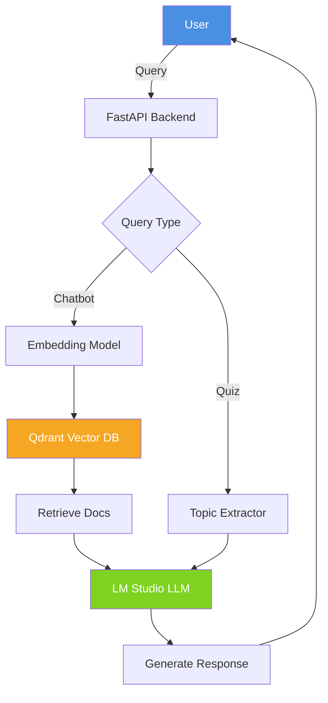

<div align="center">

# 🎓 Q&A Tutor Agent
### AI-Powered Network Security Learning System

[](https://www.python.org/downloads/)
[](https://fastapi.tiangolo.com/)
[](LICENSE)
[](https://qdrant.tech/)
[](https://huggingface.co/meta-llama)

**RAG-Powered Chatbot • Adaptive Quiz Generation • Local LLM Inference**

[Features](#-features) • [Quick Deploy](#-one-click-deployment) • [Local Setup](#-local-development) • [Documentation](#-documentation)

</div>

---

## 🚀 One-Click Deployment

Deploy to cloud platforms with automatic model downloads. Choose from CPU-based hosting or GPU platforms for faster LLM inference.

### Supported Platforms

**Cloud Hosting (CPU)**
- **Railway** - Easy deployment with automatic configuration
- **Render** - Production-ready with persistent disk storage

[](https://railway.app/new/template?template=https://github.com/UmaMaheswariAchanta/Q-A-Tutor-Agent)
[](https://render.com/deploy?repo=https://github.com/UmaMaheswariAchanta/Q-A-Tutor-Agent)

**GPU Cloud (Recommended for faster inference)**
- **RunPod GPU** - Dedicated GPU instances for LLM workloads ([Deployment Guide](./RUNPOD_DEPLOYMENT.md))
- **Vast.ai GPU** - Affordable GPU cloud computing

> **💡 Models (8.9GB) download automatically on first deployment - No manual setup needed!**

### Unsupported Platforms


**Heroku cannot deploy this project due to:**
- 500MB slug size limit (models are 8.9GB)
- No GPU support for LLM inference
- No persistent storage for large models
- 512MB-2.5GB RAM limits insufficient
- Ephemeral filesystem prevents model downloads
- CPU-only instances too slow for inference

### Run with Docker

```bash
# Build image
docker build -t qa-tutor-agent .

# Run container
docker run -d -p 8000:8000 \
  -e QDRANT_HOST=localhost \
  -e QDRANT_PORT=6333 \
  --name qa-tutor \
  qa-tutor-agent

# Access at http://localhost:8000
```

---

## ✨ Features

<table>
<tr>
<td width="50%">

### 🤖 **Intelligent Chatbot**
- RAG-powered responses using Qdrant vector DB
- Context-aware answers from documentation
- Web search fallback for unknown topics
- Source attribution with similarity scores

</td>
<td width="50%">

### ✅ **Adaptive Quizzes**
- Auto-generated from knowledge base
- 3 question types: T/F, Multiple Choice, Multi-Answer
- Instant grading with explanations
- Partial credit for multi-answer questions

</td>
</tr>
<tr>
<td width="50%">

### ⚡ **High Performance**
- Local LLM inference via LM Studio
- GPU acceleration support
- Semantic search with embeddings
- Sub-second response times

</td>
<td width="50%">

### 🌐 **Modern Web UI**
- Clean, responsive interface
- Real-time interactions
- Mobile-friendly design
- Built with FastAPI + Jinja2

</td>
</tr>
</table>

---

## 📸 Screenshots

<div align="center">

| Chatbot Interface | Quiz Generation |
|:-----------------:|:---------------:|
|  |  |

</div>

---

## 🎯 Quick Start

### Option 1: Cloud Deployment (Recommended)

**1️⃣ Fork this repository**

**2️⃣ Click a deploy button above**

**3️⃣ Wait for models to download** (~15 minutes first time)

**4️⃣ Access your app!** 🎉

That's it! The deployment system handles everything automatically:
- ✅ Creates model directory structure
- ✅ Downloads all GGUF models from HuggingFace
- ✅ Sets up Qdrant vector database
- ✅ Starts the FastAPI application

---

### Option 2: Local Development

<details>
<summary><b>📦 Click to expand local setup instructions</b></summary>

#### Prerequisites
- Python 3.11+
- Docker (for Qdrant)
- 8GB+ RAM
- 20GB+ free disk space

#### Steps

```bash
# 1. Clone repository
git clone https://github.com/UmaMaheswariAchanta/Q-A-Tutor-Agent.git
cd Q-A-Tutor-Agent-LMstudio

# 2. Install dependencies
pip install -r requirements.txt

# 3. Download models (8.9GB - takes ~10-15 minutes)
bash download_models.sh

# 4. Start Qdrant
docker run -d -p 6333:6333 -p 6334:6334 \
  -v $(pwd)/qdrant_storage:/qdrant/storage \
  qdrant/qdrant

# 5. Start LM Studio (for local LLM inference)
# - Download from: https://lmstudio.ai/
# - Load model: Meta-Llama-3.1-8B-Instruct-Q4_K_M.gguf
# - Start server on port 1234

# 6. Initialize Qdrant (first time only)
python Scripts/initialise_qdrant.py
python Scripts/Data_insertion_qdrant.py

# 7. Start application
bash start.sh
# OR: uvicorn Scripts.unified_app:app --host 127.0.0.1 --port 7860
```

**Access at:** http://127.0.0.1:7860

</details>

---

## 🏗️ Architecture

<div align="center">



</div>

---

## 🛠️ Tech Stack

| Component | Technology | Purpose |
|-----------|-----------|---------|
| **Backend** | FastAPI, Uvicorn | Web server & API |
| **LLM** | Meta-Llama-3.1-8B (Q4_K_M) | Text generation |
| **Inference** | LM Studio | Local GPU-accelerated inference |
| **Embeddings** | SentenceTransformers | Semantic search |
| **Vector DB** | Qdrant | Document retrieval |
| **Frontend** | Jinja2 Templates | UI rendering |
| **Deployment** | Docker, Railway, Render | Cloud hosting |

---

## 📁 Project Structure

```
Q-A-Tutor-Agent-LMstudio/
│
├── 🚀 Deployment Files
│   ├── download_models.sh       # Auto-downloads models
│   ├── requirements.txt         # Python dependencies
│   ├── Procfile                 # Railway/Heroku config
│   ├── Dockerfile               # Container image
│   └── docker-compose.yml       # Local Docker setup
│
├── 💻 Application
│   ├── Scripts/
│   │   ├── unified_app.py       # Main FastAPI app ⭐
│   │   ├── chatbot_application.py
│   │   ├── Quiz_Agent.py
│   │   ├── Data_insertion_qdrant.py
│   │   └── initialise_qdrant.py
│   └── templates/
│       ├── unified.html         # Main UI
│       ├── index.html
│       └── quiz.html
│
├── 📚 Data
│   └── References/              # PDF documents (28 files)
│
├── 🤖 Models (auto-downloaded)
│   └── lmstudio-community/
│       ├── Meta-Llama-3.1-8B-Instruct-Q4_K_M.gguf (4.7GB)
│       ├── Phi-3-mini-4k-instruct-q3.gguf (1.9GB)
│       └── Phi-3-mini-4k-instruct-q4.gguf (2.3GB)
│
└── 📖 Documentation
    ├── README.md                # This file
    ├── DEPLOYMENT.md            # Comprehensive guide
    └── QUICK_DEPLOY.md          # Quick commands
```

---

## 📋 System Requirements

<table>
<tr>
<th>Development</th>
<th>Production (Cloud)</th>
</tr>
<tr>
<td>

- **RAM:** 8GB minimum, 16GB recommended
- **Storage:** 20GB free space
- **GPU:** Optional (faster inference)
- **OS:** Windows, Linux, macOS

</td>
<td>

- **RAM:** 8GB minimum
- **Storage:** 20GB persistent disk
- **CPU:** 2+ cores
- **Platform:** Railway, Render, Azure, Docker

</td>
</tr>
</table>

---

## 🔧 Configuration

### Environment Variables

```bash
# Qdrant Configuration
QDRANT_HOST=localhost
QDRANT_PORT=6333

# LM Studio Configuration
LMSTUDIO_URL=http://localhost:1234/v1/chat/completions
LMSTUDIO_MODEL=meta-llama-3.1-8b-instruct

# Optional: Web Search Fallback
SERPAPI_API_KEY=your_api_key_here
```

### Customization

<details>
<summary><b>🎨 Click to see customization options</b></summary>

**Change Embedding Model** (`Scripts/unified_app.py`):
```python
embedder_chatbot = SentenceTransformer("all-MiniLM-L6-v2")
embedder_quiz = SentenceTransformer("multi-qa-MiniLM-L6-cos-v1")
```

**Adjust Retrieval Settings**:
```python
RELEVANCE_THRESHOLD = 0.40  # Similarity threshold (0.0-1.0)
NUM_QUESTIONS = 5           # Number of quiz questions
```

**Change LLM Model**:
- Download different GGUF model
- Load in LM Studio
- Update `LMSTUDIO_MODEL` variable

</details>

---

## 📖 API Documentation

<details>
<summary><b>🔌 Click to view API endpoints</b></summary>

### Endpoints

| Endpoint | Method | Description | Request | Response |
|----------|--------|-------------|---------|----------|
| `/` | GET | Home page | - | HTML |
| `/chatbot` | GET | Chatbot interface | - | HTML |
| `/quiz` | GET | Quiz interface | - | HTML |
| `/query` | POST | API query | `{"prompt": "..."}` | `{"response": "...", "source": "..."}` |
| `/query-form` | POST | Form query | `prompt=...` | HTML |
| `/generate` | POST | Generate quiz | `topic=...` | HTML with quiz |
| `/submit-quiz` | POST | Submit answers | Form data | HTML with results |

### Example API Call

```bash
curl -X POST http://localhost:7860/query \
  -H "Content-Type: application/json" \
  -d '{"prompt": "What is a firewall?"}'
```

**Response:**
```json
{
  "response": "A firewall is a network security device...",
  "source": "📄 Network Security Basics (Pg 5) — Score: 0.85"
}
```

</details>

---

## 🚢 Deployment Options

<table>
<tr>
<th>Platform</th>
<th>Difficulty</th>
<th>Cost</th>
<th>Best For</th>
<th>Deploy</th>
</tr>
<tr>
<td><b>Railway</b></td>
<td>⭐ Easy</td>
<td>Free tier</td>
<td>Quick prototypes</td>
<td><a href="https://railway.app/new">Deploy →</a></td>
</tr>
<tr>
<td><b>Render</b></td>
<td>⭐⭐ Medium</td>
<td>$7/month</td>
<td>Production apps</td>
<td><a href="https://render.com/deploy">Deploy →</a></td>
</tr>
<tr>
<td><b>Azure</b></td>
<td>⭐⭐⭐ Advanced</td>
<td>Pay-as-you-go</td>
<td>Enterprise</td>
<td><a href="DEPLOYMENT.md#azure-deployment">Guide →</a></td>
</tr>
<tr>
<td><b>Docker</b></td>
<td>⭐⭐ Medium</td>
<td>Self-hosted</td>
<td>Full control</td>
<td><code>docker-compose up</code></td>
</tr>
</table>

**📘 Detailed Guides:** [DEPLOYMENT.md](./DEPLOYMENT.md) | [QUICK_DEPLOY.md](./QUICK_DEPLOY.md)

---

## 🧪 Testing

```bash
# Test model download
bash download_models.sh

# Test Qdrant connection
curl http://localhost:6333/health

# Test LM Studio
curl http://localhost:1234/v1/models

# Test application
curl http://localhost:7860/

# Run full test suite (if available)
pytest tests/
```

---

## 🎓 Usage Examples

### Chatbot

1. Navigate to **Chatbot** tab
2. Enter: *"What is a DDoS attack?"*
3. Get AI-generated answer with sources
4. View similarity scores for retrieved documents

### Quiz

1. Navigate to **Quiz** tab
2. Enter topic: *"Firewalls"* (or leave blank for random)
3. Answer 5 auto-generated questions
4. Submit for instant grading with explanations

---

## 🗺️ Roadmap

- [x] RAG-powered chatbot
- [x] Adaptive quiz generation
- [x] Local LLM inference
- [x] Cloud deployment automation
- [ ] Multi-language support
- [ ] User authentication
- [ ] Progress tracking
- [ ] Custom quiz difficulty levels
- [ ] Mobile app (React Native)
- [ ] Analytics dashboard

---

## 🤝 Contributing

Contributions are welcome! Please follow these steps:

1. **Fork** the repository
2. **Create** feature branch: `git checkout -b feature/AmazingFeature`
3. **Commit** changes: `git commit -m 'Add AmazingFeature'`
4. **Push** to branch: `git push origin feature/AmazingFeature`
5. **Open** Pull Request

See [CONTRIBUTING.md](CONTRIBUTING.md) for detailed guidelines.

---

## 🐛 Troubleshooting

<details>
<summary><b>Models not downloading</b></summary>

```bash
# Check huggingface_hub installation
pip install --upgrade huggingface_hub

# Try manual download
python3 -c "from huggingface_hub import hf_hub_download; \
hf_hub_download('lmstudio-community/Meta-Llama-3.1-8B-Instruct-GGUF', \
'Meta-Llama-3.1-8B-Instruct-Q4_K_M.gguf', local_dir='models/lmstudio-community')"
```
</details>

<details>
<summary><b>Qdrant connection failed</b></summary>

```bash
# Start Qdrant
docker run -d -p 6333:6333 qdrant/qdrant

# Verify running
curl http://localhost:6333/health

# Or use Qdrant Cloud
# https://cloud.qdrant.io/
```
</details>

<details>
<summary><b>Out of memory</b></summary>

- Increase server RAM to 8GB+
- Use smaller model (Phi-3 instead of Llama)
- Download models sequentially (edit `download_models.sh`)
</details>

**More help:** [DEPLOYMENT.md - Troubleshooting](./DEPLOYMENT.md#-troubleshooting)

---

## 📄 License

This project is licensed under the **MIT License** - see [LICENSE](LICENSE) file for details.

```
MIT License - Copyright (c) 2024

Permission is hereby granted, free of charge, to any person obtaining a copy
of this software and associated documentation files (the "Software"), to deal
in the Software without restriction...
```

---

## 🙏 Acknowledgments

<div align="center">

**Built with these amazing technologies:**

[](https://fastapi.tiangolo.com/)
[](https://python.org/)
[](https://docker.com/)
[](https://qdrant.tech/)
[](https://huggingface.co/)

**Special Thanks:**
- [LM Studio](https://lmstudio.ai/) - Local LLM inference
- [Meta AI](https://ai.meta.com/) - Llama 3.1 model
- [Sentence Transformers](https://www.sbert.net/) - Embedding models
- [Railway](https://railway.app/) - Easy deployment platform

</div>

---

## 📞 Support & Community

<div align="center">

**Need Help?**

[](https://github.com/UmaMaheswariAchanta/Q-A-Tutor-Agent/issues)
[](https://github.com/UmaMaheswariAchanta/Q-A-Tutor-Agent/discussions)
[](./DEPLOYMENT.md)

</div>

---

## 📊 Project Stats

<div align="center">


</div>

---

<div align="center">

### ⭐ Star this repo if you found it helpful!

**Made with ❤️ for Network Security Education**

[⬆ Back to Top](#-qa-tutor-agent)

</div>
